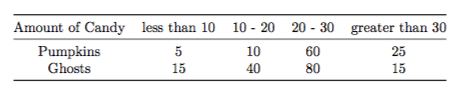
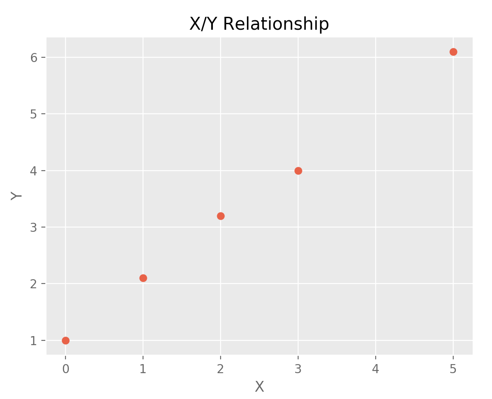
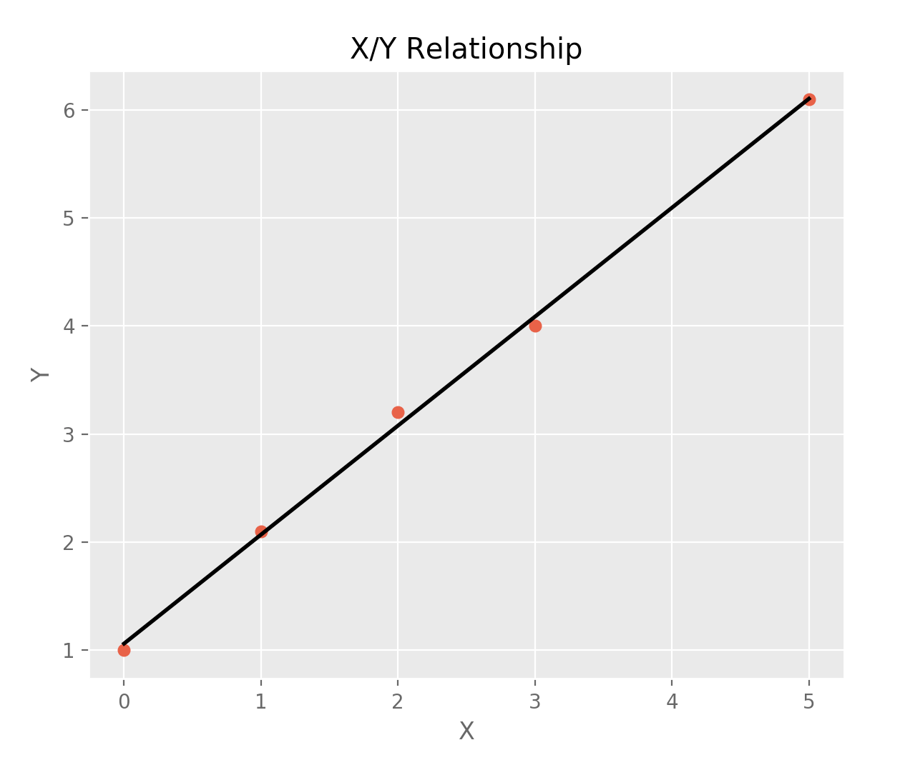
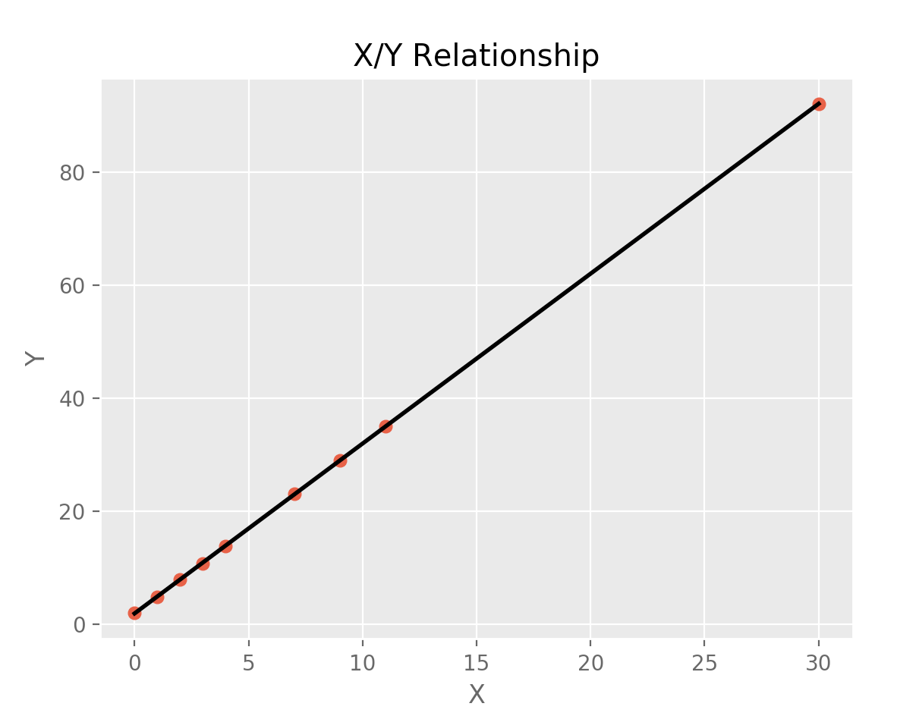
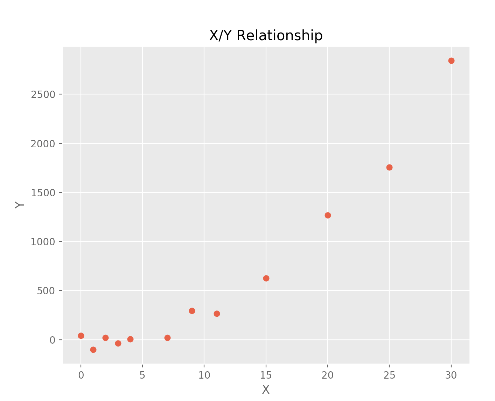

# Counting: permutations, combinations

### 1) Permutations

#### a) How many ways can you arrange the numbers 1, 2, 3, 4 and 5?

5! = 120

#### b) How many ways can you arrange 1, 1, 2, 3, 4?

5!/2! = 60

#### c) How many ways can you arrange two 3s and three 5s?

5! / ( 2!*3! ) = 10

--

### 2) Combinations

#### a) How many different poker hands (5 cards) can you have? A deck holds 52 cards.

52! / ( 5! * 47! ) = 2,598,960

#### b) There are five flavors of ice cream: Stracciatella, Mint chocolate chip, Cookies and Cream, Butter Pecan, Pistachio and Pralines and cream. How many three scoop ice-creams can you make if all the scoops must be different flavors?

5! / ( 3! * 2! ) = 10

#### *Extra Credit: what happens if you can take several scoops of the same flavor?*

5^3 = 125 possibilities

---

# Probability

### 1) Probability of an event

#### a) In a deck of cards (52 cards), what’s the probability of picking a queen? A heart? Of picking a card that’s not a queen nor a heart?

P(Queen) = 4/52 = .0769  
P(Heart) = 13/52 = .25  
P(Queen' ⋃ Heart') = 1 - P(Queen⋃Heart) = 1 - (13 + 4 - 1)/52 = .6923

#### b) If I do not replace the cards, what is the probability of picking 2 kings? 4 diamonds? How do these probabilities evolve if I replace the cards after each draw?

Two Kings = 4/52 * 3/51 = .0045

Four Diamonds = 13/52 * 12/51 * 11/50 * 10/49 = .0026

These probabilities increase if you replace the cards.

--

### 2) Probability of 2 or more events

#### a) *Conditional probability*

##### 1) What is the probability that the total of two dice is less than four, knowing that the first die is a 2?

P(Total < 4 | D1 = 2) = ( 1/36 ) / ( 1/6 ) = 1/6

##### 2) 90% of candidates to a Web developer position can code both in Javascript and HTML. 70% of these candidates can code in Javascript and 50% can code in HTML. What is the probability that a candidate can code in HTML knowing that he can code in Javascript?

P(JS ∩ HTML) = .9
P(JS) = .7
P(HTML) = .5

P(HTML | JS) = .9/.7 = 1.286

The question, and the result, make no sense. How can 90% or candidates code in both, but only 70% do one and 50% do another?

#### b) *Independent and dependent events*

#### 1) Number of kids dressed as pumpkins or ghosts on Halloween night and the amount of candy they received:



##### a)  What is the probability that a kid dressed as a pumpkin gets 20 or more pieces of candy? How about if he dresses as a ghost?

P(pumpkin_candy >= 20) = 85/100 = .85

P(ghost_candy >= 20) = 95/150 = .6333

##### b) What is the probability that a kid obtains less than 10 pieces of candy?

P(pumpkin_candy ⋃ ghost_candy < 10) = 20/250 = .08

##### c) What is the probability that two siblings, one dressed as a ghost and one dressed as a pumpkin, each receive 20 to 30 pieces of candy?

P(20 <= pumpkin_candy <= 30) = 1/6  
P(20 <= ghost_candy <= 30) = 8/15

P(20 <= ghost_candy <= 30 ∩ 20 <= pumpkin_candy <= 30) = 8/75 = .1067

#### 2) You toss a fair die twice. What is the probability of getting less than 3 on the first toss and an even number on the second?

2/6 * 3/6 = 1/6 = .1667

#### c) *Mutually exclusive events*

#### 1) Let’s consider a population from which we draw a sample of 40 individuals. The probability of your sample having no-one with glasses is 26%. The probability of having only one individual wearing glasses is 32%. What is the probability of

##### a) Obtaining not more than one individual wearing glasses in a sample?

.32 + .26 = .58

##### b) Obtaining more than one individual wearing glasses in a sample?

1 - .58 = .42

#### d) *Bayes’ Theorem*

##### 1) To detect a medical condition, patients are given two tests. 25% of the patients receive positive results on both tests and 42% of the patients receive positive results on the first test. What percent of those who have positive results on the first test passed also had positive result on the second test?

I don't believe this is actually a Bayesian problem, but just a conditional probability problem? I feel like there's no posterior update to the probability...

The two facts are:

P(test_1_positive) = .42

P(test_1_positive ∩ test_2_positive) = .25

SO!

P(test_2_positive | test_1_positive) = P(test_1_positive ∩ test_2_positive) / P(test_1_positive) = 

P(test_2_positive | test_1_positive) = .25/.42 = .5952

---

# Probability distributions Problems

### 1) Binomial distribution

#### a) Fair coin: Imagine you were to flip a fair coin 10 times. What would be the probability of getting 5 heads?

P(H = 5) = 10!/(5!5!) * .5^5 * .5^5 = 252 * 0.03125 * 0.03125 = .2461

#### b) Unfair coin: You have a coin with which you are 2 times more likely to get heads than tails. You flip the coin 100 times. What is the probability of getting 20 tails? What is the probability of getting at least one heads?

• P(T = 20) = 100!/(20!80!) * .33^20 * .67^80 = .0015

• P(H >= 1) = 1 - P(T = 100) = 100!/(100!0!) * .33^100 * .67^0 = 7.102*10^-49

--

### 2) Geometric distributions

#### a) Suppose you have an unfair coin, with a 68% chance of getting tails. What is the probability that the first head will be on the 3rd trial?

P(H = 3) = (1 - .32)^2 *.32 = .148

--

### 3) Poisson distribution

#### a) On average 20 taxis drive past your office every 30 minutes. What is the probability that 30 taxis will drive by in 1 hour?

P(X = 30) = ( e^-40 * 40^30 ) / 30! = .0185

--

### 4) Exponential distribution

#### a) Let X, the number of years a computer works, be a random variable that follows an exponential distribution with a lambda of 3 years. You just bought a computer, what is the probability that the computer will work in 8 years?

P(X >= 8) = e^(-3 * 8) = 3.775 * 10^-11

--

### 5) Uniform Distribution

#### a) Let the random variable X be the angle of a slice of pizza. The angle X has a uniform distribution on the interval [0, 90]. What is the probability that your slice of pizza will have an angle between 30 and 40°?

P(30 <= X <= 40) = P(X<=40) - P(X<=30) =  40/90 - 30/90 = .1111

--

### 6) Normal Distribution

#### a) Suppose X has a standard normal distribution. Compute P (X > 9), P (1 < X < 3) and P (X > −3)

• P(X > 9) = A very, very, very small percentage.

• P(1 < X < 3) = .9987 - .8413 = .1574

• P( X > -3 ) = 1 - .0013 = .9987

#### b) The weight in pounds of individuals in a population of interest has a normal distribution, with a mean of 150 and a standard deviation of 40. What is the expected range of values that describe the weight of 68% of the population (Hint: use the empirical rule)? Of the people who weigh more than 170 pounds, what percent weigh more than 200 pounds (Hint: this is conditional probability)?

• P(X) = 68%?

E(X) +/- σ

68% of people are between 110 and 190 pounds.

• P( X > 200 | X > 170 )?

P( X > 200 | X > 170 ) = P(X > 200 ∩ X > 170) / P( X > 170 )

P(X > 200 ∩ X > 170) =  P(X > 200) = 1 - z(1.25) = 1 - .8944 = .1056

P( X > 170 ) = 1 - z(.5) = 1 - .6915 = .3085

.1056/.3058 = .3453

---

# Descriptive Statistics

### 1) 3 Measures of Average

#### a) Give the mean, median and mode of the following data:
```
20, 45, 68, 900, 57, 45, 33, 35, 45, 22
```
Mean = 127  
Median = 45  
Mode = 45

#### b) Do you think the mean is a good summary statistic? Why or why not?

Yes and No. The mean is very intuitive and helps when explaning data. However it works best when the data is more uniform since it can be skewed by outliers, as it is above. A trimmed mean can be used in cases such as this.

--

### 2) Variance, Range, IQR

#### a) Give the mean, the variance, the standard deviation, the range and the interquartile of range of the following data:  
```
20, 45, 68, 900, 57, 45, 33, 35, 45, 22
```

Mean =  127  
Varinace = 73984  
Standard Deviation = 272  
Range = 880  
Interquartile Range =  35  

--

### 3) Discrete random variables

#### a) Give the expression of the mean and the variance for a discrete random variable X

I'm sorry, I don't want to write this out in MathML. Here they are in plain text:

E(x) = Sum[ x[sub(i)] * P(x[sub(i)]) ]

σ^2 = Sum[ ( x[sub(i)] - E(x) ) * P(x[sub(i)]) ] 

#### b) Give the expression of the mean and the variance for a continuous random variable X

E(x) = Intergral[sub(state space)]xf(x)dx

σ^2 = Sum[ ( x[sub(i)] - E(x) ) * P(x[sub(i)]) ]

---

# Inferential Statistics

### 1) Cofidence Intervals

#### a) We are polling to get the approval rate of the president. Out of a population of 4 million, 6014 were surveyed and 3485 expressed their approval. Construct a 95% confidence interval for the approval rate of the president.

.5795 +/- 1.96 * ( ( ( .5795 * .4205 )/6014 )^.5 ) = 

.5795 +/- .0125 =

56.7% to 59.2% approval rating

#### b) The weight of a random sample of 100 individuals from a population of interest was surveyed and yielded a sample average weight of 150 pounds and sample standard deviation of 20 pounds. Construct a 95% confidence interval for the average weight of the population.

150 +/- 1.984 * ( 20/( 100^.5 ) ) = 

150 +/- 3.96 = 

146.04 to 153.96 pounds

--

### 2) General Hypothesis Testing

#### 1) What is the definition of a significance level? Of a p-value?

The significance level for a hypothesis test is the maximum probability that we will reject a true null hypothesis. 

The p-value, also called the observed level of significance, is the lowest possible level of significance at which a null hypothesis can be rejected.

#### 2) Would you use a one tailed or two tailed tests in the following cases:

**• Investigating if women are paid less than men.**  
You are comparing two sample means to see if one is larger than another. One-tailed.

**• Comparing the click-through rate of website when the ‘subscribe’ button is green vs. when it is blue.**  
Could be either. 'Comparing' could mean checking if they are equal, larger, or smaller.

#### 3) A man goes to trial. In a hypothesis testing framework, let’s define the null hypothesis as Not Guilty and the alternative hypothesis as Guilty.

**• What type of error is made when the man is actually not guilty but verdict returned is guilty?**  
Null hypothesis is true but rejected. Type I error.

**• What type of error is made when the man is actually guilty but verdict returned is not guilty?**  
Null hypothesis is false but fails to be rejected. Type II error.

--

### 3) One sample hypothesis testing

#### 1) We want the test the hypothesis that at least 68% of the Canadian population (aged 18+) went to the movies at least once in the past 12 months with a significance level of 5%. We surveyed 4,000 respondents and found 3,012 did go at least once to the movies in the past 12 months. How would your conclusion compare if you only had 40 respondents, 30 of which went to the movies at least once in the past 12 months

null_hypothesis: movie_attendence >= .68

std_error_sample = ( ( .68 * .32 )/ 4000 )^.5 =

std_error_sample = .0074

test_stat = ( .753 - .68 )/.0074 = 

test_stat = 9.865 *DAMN*

So p_value is > .99?

Failed to Reject Hypothesis. We are almost certain to commit a Type I error if we do.

**What about a 30/40 sample-sucess/population?**

std_error_sample = ( ( .75 * .25 )/ 40 )^.5 =

std_error_sample = .0686

test_stat = ( .75 - .68 )/.0686 =

test_stat = 1.02

p_value = .8461

The standard error is much higher with a smaller sample size, so the test stat isn't so crazy high. However, there is still an 84% chance that we will commit a Type I error if we reject this null hypothesis.


#### 2) We want to test the hypothesis that the average weight in North America is at least 175 pounds. The mean of weights of the 100 individuals sampled is 178 pounds, with a sample standard deviation of 8 pounds. What are you conclusions?

null_hypothesis: mean weight equals 175

test_stat = ( 178 - 175 ) / ( 8 / ( 100^.5 ) ) = 

test_stat = 3.75

df = 99

p_value < .01

Rejected Hypothesis. There is a less than 1% chance that we will not make a Type I error when rejecting this null hypothesis. 

#### 3) We want to investigate the claim that on average, sea turtles lay 110 eggs in a nest. Volunteers have gone out and counted the number of eggs in 20 nest. What do you conclude?

**Data:**  
```
101, 120, 154, 89, 97, 132, 126, 105, 94, 111, 98, 90, 88, 115, 
99, 85, 131, 127, 116
```

Sample Mean = 109  
Sample Standard Deviation = 18.71

null_hypothesis: mean egg count equals 110

test_stat = ( 109 - 110 ) / ( 18.71 / 20^.5 ) = 

test_stat = -0.239

df = 19

p_value > .2

Failed to Reject Hypothesis. There is a greater than 20% chance that we will make a Type I error if we reject this null hypothesis.

--

### 4) Two sample hypothesis testing

#### 1) Is there a meaningful difference between the proportion of teenagers vs that of adults that go to the movies at least once per month?

**Data:**  
– 1000 teenagers are surveyed, 780 answer positively.  
– 1000 adults are surveyed, 620 answer positively.

null_hypothesis: teenager proportion = adult proportion

pop_prop_estimate = 780+620/2000 = 
 
pop_prop_estimate = .7

test_stat = ( .78 - .62 ) / ( .7 * .3 * ( 1/1000 + 1/1000 ) )^.5 = 

test_stat = 7.807

p_value < .01

Reject Null Hypothesis. There is a chance much lower than 1% that we will make a Type I error rejecting this hypothesis.

#### 2) Is there a meaningful difference between the average wingspan of bald eagles vs that of crowned eagles?

**• Data for bald eagles (in ft):**  
```
[7.4, 7.7, 6.0, 6.7, 8.3, 6.5, 6.9, 7.7, 7.8, 7.3, 6.9, 6.5, 6.3, 
4.8, 8.0, 6.8, 5.8, 6.9, 6.3, 6.3, 6.4, 5.1, 6.9, 7.6, 5.6, 6.5, 6.7, 7.8, 6.6, 
6.9, 7.0, 6.4, 7.4, 6.0, 7.0, 5.3, 5.8, 6.4, 7.1, 5.5, 7.0, 6.7, 5.8, 6.1, 7.1, 
7.9, 7.7, 6.2, 5.3, 6.4, 6.9, 5.9, 7.8, 5.6, 5.0, 5.5, 6.4, 7.1, 8.6, 9.3, 6.8, 
7.6, 7.2, 7.1, 5.8, 5.9, 5.1, 6.6, 6.8, 5.7, 6.3, 7.3, 6.3, 7.2, 7.7, 6.0, 7.2, 
5.9, 7.2, 7.0, 7.4, 6.5, 7.8, 5.9, 6.3, 6.3, 8.3, 5.9, 6.9, 7.8]
```

**• Data for crowned eagles (in ft):**  
```
[5.3, 5.6, 5.8, 5.3, 5.6, 4.9, 5.7, 5.4, 5.8, 5.4, 6.0, 5.4, 
5.1, 5.4, 5.2, 5.7, 4.8, 5.8, 5.7, 5.1, 5.3, 5.4, 5.7, 6.6, 5.0, 5.4, 5.3, 5.5, 
5.2, 5.6, 5.2, 5.9, 5.7, 5.8, 5.5, 5.2, 4.0, 5.8, 5.2, 6.2, 5.4, 4.6, 5.3, 5.8, 
6.3, 4.8, 5.6, 5.4, 5.2, 5.4, 5.1, 6.0, 6.1, 5.4, 5.4, 5.3, 5.0, 6.0, 5.0, 5.8, 
5.1, 5.3, 4.8, 5.6, 5.7, 6.1, 5.0, 6.4, 5.1, 4.6, 5.3, 6.0, 4.8, 5.4, 4.3, 5.4, 
5.1, 4.7, 6.0, 5.5, 5.4, 5.6, 5.2, 5.8, 5.3, 4.9, 5.3, 5.5, 5.7, 4.7, 6.0, 5.6, 
4.9, 5.4, 4.3, 5.5, 4.9, 5.3, 5.6, 6.0]
```
null_hypothesis: mean bald eagle wingspan = mean crowned eagle wingspan

bald_eagle_mean = 6.7
bald_eagle_stddev = .867

crowned_eagle_mean = 5.4
crowned_eagle_stddev = .4558

test_stat = ( ( 6.7-5.4 ) - 0 ) / ( ( .867^2/90 + .4558^2/100 )^.5 ) =

test_stat = 12.73

p_value < .01

Reject Null Hypothesis. There is a chance much lower than 1% that we will make a Type I error rejecting this hypothesis.

---

# Relationship between two quantitative variables

### 1) Dataset:

```
x = [0,1,2,3,5]
y = [1, 2.1, 3.2, 4, 6.1]
```

#### a) Plot corresponding the scatter plot



#### b) Find the least square regression line y = ax + b. Add it to your plot.

y = 1.008x + 1.062



#### c) Estimate the value of y when x = 4.

y = 5.095

#### *Extra Credit*: Can you do these steps in Python?

```
import pandas as pd
import matplotlib.pyplot as plt
plt.style.use('ggplot')
import statsmodels.formula.api as smf
import numpy as np

x = [0,1,2,3,5]
y = [1, 2.1, 3.2, 4, 6.1]

df = pd.DataFrame(list(zip(x, y)), columns=["x", "y"])

fig, ax = plt.subplots()

ax.scatter(df.x, df.y)
ax.set_xlabel("X")
ax.set_ylabel("Y")
ax.set_title("X/Y Relationship")

# plt.show()

linear_model = smf.ols(formula='y ~ x', data=df)
relationship_model = linear_model.fit()

print relationship_model.params

x = np.linspace(0, 5, num=5)

ax.plot(x, relationship_model.params[0] + relationship_model.params[1] * x,
       linewidth=2, c="black")

plt.show()

print (relationship_model.params[0] + (relationship_model.params[1] * 4))
```

--

### 2) Dataset:

```
x = [0, 1, 2, 3, 4, 7, 9, 11, 30]
y = [2, 4.9, 8, 10.8, 13.9, 23.1, 29, 35, 92.1]
```
#### a) Find the least square regression line for the given data points.

y = 3.006x + 1.933

#### b) Plot the given points and the regression line on the same graph.



--

### 3) We have the following (x,y) points:

```
[(0, 42.0), (1, -101.0), (2, 21.0), (3, -38.0), (4, 5.0), (7, 20.0), 
(9, 293.0), (11, 266.0), (15, 625.0), (20, 1266.0), (25, 1757.0), 
(30, 2844.0)]
```

#### a) Plot the data



#### b) How do you think a linear model would perform? How about a 100 degree polynomial model? How would you figure out which of these models was preferable?

I don't think a linear model would perform well here. I think a 2 degree polynomial model would be appropriate. I'm not sure, but I don't think a 100 degree polynomial model fits, or exists?

I could use Root-Mean-Squared-Error to figure out which model was preferable, though I think just looking at it works for starters.

#### c) How would you model the relationship between these features?

With a polynomial model, though that's just my initial assumption.

--

### 4) We have a dataset that gives the height and age of a sample of people. The range of age spans from 1 to 60 years. We decide to compute the correlation coefficient to model to understand the relationship between these features.

#### a) Do you expect the correlation coefficient to be positive or negative?

Positive, since you grow as you progress through youth.

#### b) What are some of the limitation of this approach?

We are looking at too much data - from approximately 20 to 60, people do not, on average, grow. Including those ages dilutes the correlation. The areas of interest are either before 20, where I would predict strong correlation, and after 20, where I would predict weak correlation.

---

# Modeling

#### 1) What is Linear and Logistic Regression? How are they different?

Linear regression is used to make a value prediction.

Logistic regression is used to make a binary classification. It is not predicting a value of *y*, but rather the probability that an outcome is a success or failure.

--

#### 2) Describe cross-validation and its role in model selection.

Cross validation is the method by which you pass different traning/test selections of your dataset to your model and measure the prediction error, averaging all results to estimate the performance of the model's prediction given new data.

When selecting a method with which to model the data, cross validation allows you to compare different methods by both their prediction error and their tendency to over-fit. 

--

#### 3) Generally speaking, as we increase the complexity of the model we are evaluating, how is the behavior of the model’s bias and variance changing?

Increasing the complexity of a model will lower the bias, improving the accuracy of a prediction on the given data. It will also, however, increase the variance of the predictions, resulting in a wider range of predictions given new data or different silces of the existing data. This is in part due to over-fitting.

--

#### 4) A bank that grants auto loans is building a model, using historical sales data, to predict the price that a used car will sell for. Why is the average error between the predicted and actual price NOT an appropriate for evaluating the performance of the model?

The simple average error ignores symmetric errors, and can produce a negative result. The Root Mean Squared Error would be a better metric for evaluating the model.

--

#### 5) In linear regression, how should coefficients be interpreted? What is the difference between the size of a coefficient versus its statistical significance?

The coefficient of a variable is the marginal magnitude of that variable's impact on the prediction.

The size of a coefficient is the magnitude of its effect on the prediciton, while the statistical significance is the confidence in the accuracy of its value.

--

#### 6) Name two ways to measure the accuracy of a linear regression model.

The Coefficient of Determination and the Root-Mean-Squared-Error.


